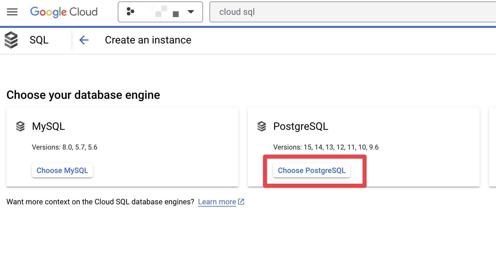

# Micronaut Starter Analytics 

Starter analytics stores information about the applications that [Micronaut Launch](https://launch.micronaut.io) generated.

Starter Analytics deploys a web application to [Google Cloud Run](https://cloud.google.com/run/). The application uses a [PostgreSQL](https://www.postgresql.org) database. It persists an application and its selected features.

It exposes an endpoint that saves an application in the database. Micronaut Launch backend invokes that endpoint when a new application is generated. API Key authentication is used to secure the communication between both services.


## Local Development

### GitHub Application:

- Register a [GitHub App](https://docs.github.com/en/apps/creating-github-apps/registering-a-github-app/registering-a-github-app)

- Setup the callback as illustrated in the next image:


Generate a Client and ID and Client Secret. 


### Local Development File

Create a local development file: 

`src/main/resources/application-dev.properties`

```properties
api.key=xxx
micronaut.security.oauth2.clients.github.client-secret=ZZZZZZZZZZ
micronaut.security.oauth2.clients.github.client-id=YYYYYY
micronaut.security.token.jwt.signatures.secret.generator.secret=pleaseChangeThisSecretForANewOne
micronaut.starter.analytics.github.allowed-usernames[0]=sdelamo
micronaut.starter.analytics.github.allowed-usernames[1]=timyates
```
> Update `micronaut.security.oauth2.clients.github.client-secret` and `micronaut.security.oauth2.clients.github.client-id` with the values obtained from the GitHub App.

### Run and login

Then, run the application via:

```shell
./gradlew run
```

and open http://localhost:8080 in a browser.

To login, use the link in the top menu


(to log out again, navigate to http://localhost:8080/logout)

## Database Schema


## Distribution to Google Cloud Run via GitHub Actions

### Cloud Run

To make your life easier, export these environment variables so that you can copy and paste the commands used here. Choose whatever name you want, but the $PROJECT_ID has to be a unique name, because project IDs can't be reused in Google Cloud.

```
export PROJECT_ID=
export ACCOUNT_NAME=
```

For example, your commands should look something like this:

```
export PROJECT_ID=foobar
export ACCOUNT_NAME=foobar
```

Log in with your Google account:

```
gcloud auth login
```

```
gcloud projects create $PROJECT_ID
gcloud config set project $PROJECT_ID
```

Enable billing for your project, and create a billing profile if you don’t have one:

```
open "https://console.cloud.google.com/billing/linkedaccount?project=$PROJECT_ID"
```

Enable the necessary services:

```
gcloud services enable cloudbuild.googleapis.com run.googleapis.com containerregistry.googleapis.com
```

Create a service account:

```
gcloud iam service-accounts create $ACCOUNT_NAME --description="Cloud Run deploy account" --display-name="Cloud-Run-Deploy"
```

Give the service account Cloud Run Admin, Storage Admin, and Service Account User roles. You can’t set all of them at once, so you have to run separate commands:

```
gcloud projects add-iam-policy-binding $PROJECT_ID --member=serviceAccount:$ACCOUNT_NAME@$PROJECT_ID.iam.gserviceaccount.com --role=roles/run.admin

gcloud projects add-iam-policy-binding $PROJECT_ID --member=serviceAccount:$ACCOUNT_NAME@$PROJECT_ID.iam.gserviceaccount.com --role=roles/storage.admin

gcloud projects add-iam-policy-binding $PROJECT_ID --member=serviceAccount:$ACCOUNT_NAME@$PROJECT_ID.iam.gserviceaccount.com --role=roles/iam.serviceAccountUser

gcloud projects add-iam-policy-binding $PROJECT_ID --member=serviceAccount:$ACCOUNT_NAME@$PROJECT_ID.iam.gserviceaccount.com --role=roles/artifactregistry.writer
```

Generate a key.json file with your credentials, so your GitHub workflow can authenticate with Google Cloud:

```
gcloud iam service-accounts keys create key.json --iam-account $ACCOUNT_NAME@$PROJECT_ID.iam.gserviceaccount.com
```

### GitHub Actions

GitHub, you need to set up a secrets environment in your repository, with the following values:

- `GCP_PROJECT_ID` is your `$PROJECT_ID`.
- `GCP_APP_NAME` is your app name.
- `GCP_CREDENTIALS` is the content from the key.json file that you just created.

For example, your settings should look something like this:

`GCP_PROJECT_ID = foobar`  
`GCP_APP_NAME = foobar`

Cat the `key.json` content and paste it into the `GCP_CREDENTIALS` secret value.

Now you just need to create a YAML file telling which commands your workflow should run. In your project directory, create a folder called `.github` and create another one inside it called `workflows`.

See the workflows in this project for examples.

## Cloud SQL Setup


### Cloud SQL Instance

Create an instance of Cloud SQL:


Choose PostgreSQL as your database engine:




Configure it with the following options:


### Databases

Create two databases `grailsforge-production` and `grailsforge-snapshot`


## Cloud Run environment variables

| Name                                                              | Value                                          | 
|:------------------------------------------------------------------|:-----------------------------------------------|
| `MICRONAUT_ENV_DEDUCTION`                                         | `false`                                        |
| `MICRONAUT_ENVIRONMENTS`                                          | `gcp`                                          |
| `API_KEY`                                                         | `Allowed API Key`                              |
| `CLOUD_SQL_CONNECTION_NAME`                                       | `GC_PROJECT_ID:REGION:CLOUD_SQL_INSTANCE_NAME` |
| `DATASOURCES_DEFAULT_PASSWORD`                                    | Database password                              | 
| `DATASOURCES_DEFAULT_USERNAME`                                    | Database username                              |
| `DB_NAME`                                                         | Database name                                  |
| `DATASOURCES_DEFAULT_URL`                                         | Database JDBC URL                              |
| `MICRONAUT_SECURITY_OAUTH2_CLIENTS_GITHUB_CLIENT_SECRET`          | Obtained from GitHub                           |                                               | 
| `MICRONAUT_SECURITY_OAUTH2_CLIENTS_GITHUB_CLIENT_ID`              | Obtained from GitHub                           |   
| `MICRONAUT_SECURITY_TOKEN_JWT_SIGNATURES_SECRET_GENERATOR_SECRET` | Secret to sign JWT                             |
| `MICRONAUT_STARTER_ANALYTICS_GITHUB_ALLOWED_USERNAMES`            | Comma sepated list of users                    | 